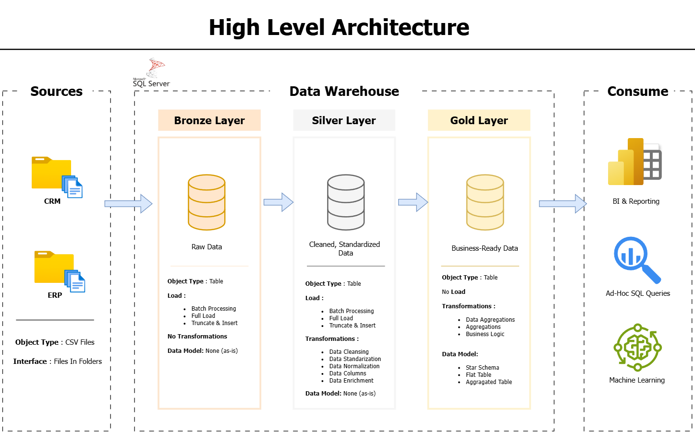
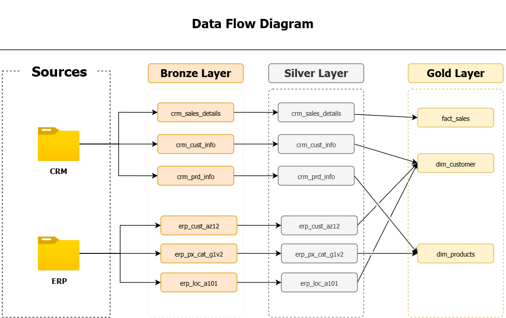
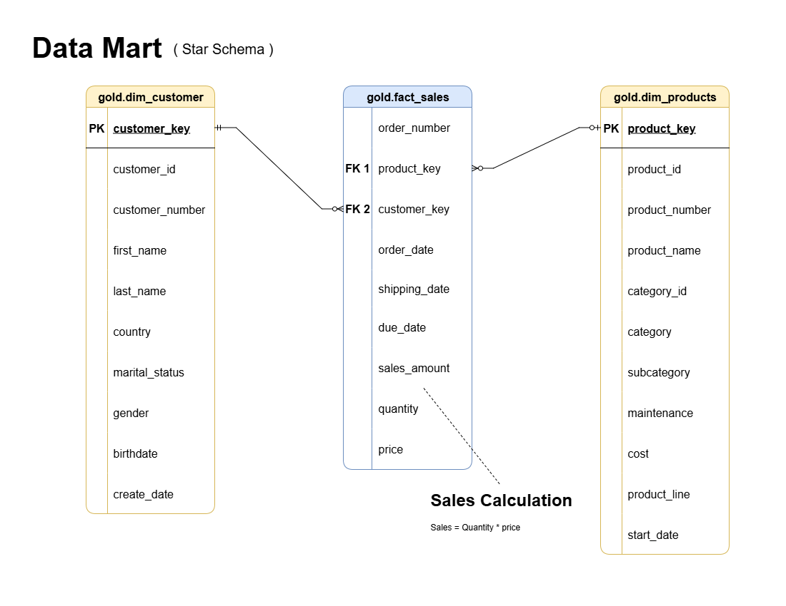

# 🧠 Data Warehouse & Analytics Project

Welcome to the **Data Warehouse & Analytics Project** — a hands-on implementation that demonstrates how to design, build, and analyze a modern **data warehouse using SQL Server**.

This project illustrates a **complete end-to-end data workflow** — from raw data ingestion (Bronze Layer) to transformation (Silver Layer), and finally to business-ready analytics (Gold Layer).  
It serves as a personal learning project to strengthen my expertise in **data engineering, ETL design, and data modeling** following **industry best practices**.

---

## 🧩 Project Overview

### 🏗️ Architecture Summary
The data warehouse follows a **layered architecture** for data transformation and enrichment:

| Layer | Description |
|-------|--------------|
| 🥉 **Bronze Layer** | Raw ingestion of data from CRM and ERP systems. |
| 🥈 **Silver Layer** | Cleansed and standardized data prepared for analytics. |
| 🥇 **Gold Layer** | Business-level dimensional model for reporting and dashboards. |

---

## 🔄 ETL Workflow (Data Flow)

The ETL process is designed to extract, transform, and load data through each layer.  
Data is extracted from flat files (CSV), transformed using SQL logic, and loaded into structured schemas.

---

## 🧱 Data Modeling (Star Schema)

The **Gold Layer** uses a **Star Schema** to model analytical data:
- **Dimension Tables** provide context (e.g., customers, products).  
- **Fact Tables** store transactional sales metrics.  

---

## ⚙️ Implementation Details

### 🗃️ Database Schemas
| Schema | Purpose |
|---------|----------|
| `bronze` | Stores raw data imported directly from CSV sources. |
| `silver` | Contains cleansed and standardized tables. |
| `gold` | Hosts analytical views like `dim_customers`, `dim_products`, and `fact_sales`. |

### 🧰 Key Features
- **Automated Load Procedures** — Stored procedures handle transformation logic (`silver.load_silver`).
- **Data Standardization** — Clean handling of nulls, missing fields, and code mappings.
- **Surrogate Keys** — Implemented for dimension tables for join efficiency.
- **Audit Columns** — Track ETL timestamps with `dwh_create_date`.

---

## 🗂️ Project Documentation

| Document | Description |
|-----------|--------------|
| 📘 [Naming Conventions](docs/naming_conventions.md) | Rules for naming schemas, tables, columns, and stored procedures. |
| 📗 [Data Catalog (Gold Layer)](docs/data_catalog.md) | Detailed documentation of tables, columns, and business purpose for Gold Layer. |

---

## 🧮 Key Technologies

| Category | Tools |
|-----------|-------|
| 💾 Database | SQL Server 2022 |
| ⚙️ ETL | T-SQL Stored Procedures |
| 🧩 Modeling | Star Schema (Fact & Dimension) |
| 🧠 Version Control | Git & GitHub |

---

## 🧭 Summary
This project showcases a **complete data engineering pipeline** using a **layered data warehouse architecture**.  
It applies **modern data modeling principles**, **SQL-based ETL**, and **clear documentation** to produce an analytics-ready system.

---

### 👨‍💻 Author
**Ilham Muhammad Arsyad**  
